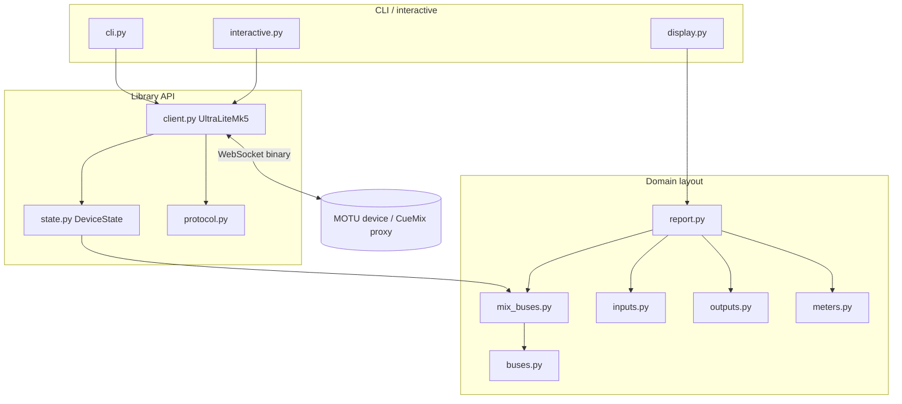

# ultralite-mk5-lib — agent guide

Python library and CLI for controlling MOTU UltraLite mk5 / Gen5 devices over the same WebSocket property protocol used by CueMix 5.

## CueMix reference sources

When reverse-engineering protocol behavior, property IDs, mix layout, or UI semantics, **consult the official CueMix web app sources** in:

```
cuemix/www/
```

This folder is a local copy of the CueMix 5 Electron `www` bundle (shipped as plain `.js`, not a bundled SPA). It may be absent in a fresh clone or listed in `.gitignore`; if `cuemix/` is missing, user must obtain it from a CueMix install before relying on file-level references.

For CueMix app architecture (boot flow, UI layers, data flow, meter rates), see [`cuemix/AGENTS.md`](cuemix/AGENTS.md).

### Key CueMix files

| File | Use for |
|------|---------|
| `datastore.js` | WebSocket send/recv, `CreateDeviceMessage` / `UnpackDeviceMessage`, auth |
| `dev.js` | UltraLite mk5 property catalog (`kDevJS`), mix bus layout |
| `dev_common.js` | Wire types, sample rates, message IDs (`kMetersID` = 6000) |
| `mixmgr.js` | Mix bus tabs, fader/mute wiring |
| `meterstore.js` | Meter peak ingest, decay animation, `kUIMeterFPS` |
| `iosetup.js` | Input/output routing labels, meter slot visibility |
| `proxy.js` | `0xFFFE` proxy sub-messages |

Do not treat `chat_export.md` as authoritative; prefer `cuemix/www/` and this library’s Python modules.

## Architecture



### Module roles

| Module | Responsibility |
|--------|----------------|
| `client.py` | `UltraLiteMk5`: connect, auto-reconnect, background recv thread, connection callbacks, outbound commands (sample rate, optical mode, bus mute, solo). Connect returns once the WebSocket is up; state fills in the background. |
| `state.py` | `DeviceState`: parses inbound frames into `props` and `meters`. `PROPERTY_TABLE` mirrors CueMix property IDs. `reset()` on disconnect. `is_ready()` / `wait_until_ready()` for commands that need full mix state. |
| `protocol.py` | URL building (`ws://host:1280` direct, `ws://127.0.0.1:1281/<serial>` via local proxy), outbound frame builders. |
| `buses.py` | Mix **output bus** names and `koBusMute` indices; solo bus resolution. |
| `mix_buses.py` | Per-bus **mix matrix** (inputs → reverb → host L/R → out), `kiMixFader` / `kiMixMute` indexing. |
| `inputs.py` | Analog input gain (`kiGain`) labels and ranges. |
| `outputs.py` | Output trim (`koTrim`), monitor/main trim, output monitoring helpers. |
| `meters.py` | Meter slot index → human label (CueMix tab order). |
| `report.py` | JSON-serializable `get-state` report (`build_state_report`). |
| `display.py` | Rich terminal tables (`get-state`, `monitor-meters`). |
| `interactive.py` | REPL after `connect`; state-heavy commands wait for readiness. |
| `cli.py` | One-shot commands and `connect` entry point. |
| `benchmark_meters.py` | Internal meter throughput benchmark (no Rich). |

### Connection model

- **Fast connect**: open WebSocket, start recv loop, return without draining the initial property burst.
- **Auto-reconnect** (default `auto_reconnect=True` on `UltraLiteMk5`): when the WebSocket drops, the recv thread calls `DeviceState.reset()`, fires `on_connection_lost` once, and a background thread retries every `reconnect_interval` seconds (default 1.0) until the device is reachable again. On success, `on_connection_restored` fires once and the property burst repopulates state. Pass `auto_reconnect=False` for fail-fast one-shot scripts.
- **`wait_until_connected()`**: block until connected (forever by default). Used internally by outbound commands when auto-reconnect is enabled.
- **Interactive CLI**: registers `on_connection_lost` to print one `Waiting for device...` line to stderr; `require_device()` waits instead of raising `NotConnectedError`.
- **Long-lived integrations** (e.g. Home Assistant): hold one `UltraLiteMk5` with callbacks to mark entities unavailable on disconnect and available after restore; use `state.add_observer()` for property updates; run blocking API calls in a worker thread.
- **Outbound-only commands** (`set-mute`, `solo-output-bus`, `set-sample-rate`, `set-level`, `set-optical-input-mode`, `set-optical-output-mode`): send frames immediately once connected; block until reconnected when auto-reconnect is on.
- **State-heavy commands** (`get-state`, `monitor-meters`): wait for `DeviceState.is_ready()` or `meters_received`, with a stderr notice if needed. After reconnect, readiness must be re-established because `reset()` clears cached props.

Assumes device password protection is **disabled** (`fffe 0002 00` on connect). Password auth is not implemented.

### Wire protocol (summary)

- Binary WebSocket frames; big-endian integers.
- Property frames: `[msg_id u16][index u16][payload…]`.
- Special IDs: `6000` meter peaks, `0xFFFE` proxy, `0xFFFF` proxy status.
- Mix fader flat index: `output_bus * 32 + input_channel` (`mix_buses.mix_fader_index`).
- Float properties use 8.24 fixed point on the wire (`state.K824_DIVISOR`).

Full encoding details live in `cuemix/www/datastore.js` and `dev_common.js`.

### Mix bus matrix (display / JSON)

Rows = channels (Mic/Line In, S/PDIF, Optical, Reverb, Host L/R, Out). Columns = mix buses. Each cell has `gain`, `db`, and per-channel `mute`. Bus-level `mute` on the Out column is `koBusMute`.

Column order matches CueMix bus strips: inputs → Reverb → Host L → Host R → Out.

## Development

```bash
pip install -e .
cp config.yaml.example config.yaml   # edit host/serial
python -m ultralite_mk5_lib connect
```

Dependencies: `pyproject.toml`

### Conventions

- Match existing naming and layout when extending property support; add IDs to `state.PROPERTY_TABLE` and domain modules as needed.
- Prefer CueMix source (`cuemix/www/`) over guesses for indices and channel order.
- Keep CLI display logic in `display.py`; keep wire/domain logic out of Rich code.
- Minimize scope: small, focused diffs; do not commit `cuemix/` unless the repo owner explicitly chooses to.
